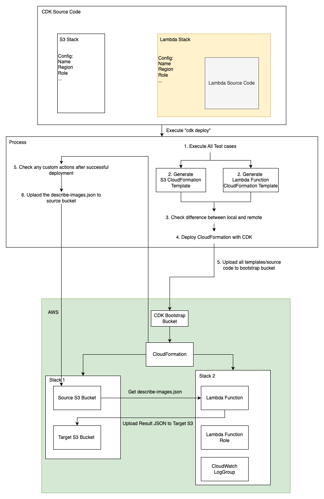

# AWS CDK Project README

This project uses AWS CDK to deploy an S3 bucket infrastructure and a Lambda function that processes JSON data from S3, leveraging AWS SDK v3 and a custom IAM role with least privilege.

## Prerequisites

- Node.js: Version 22.x
- AWS CLI: Version 2.x
- AWS CDK: Version 2.x
- AWS Account: With permissions to create CloudFormation stacks, S3 buckets, Lambda functions, and IAM roles.

## Setup
### Working Directory: `./cdk`
1. **Install Dependencies:**

    ```sh
    npm install
    ```

2. **Configure AWS CLI:**

    - Set up your AWS credentials and region:

        ```sh
        aws configure
        ```

    - Example configuration:
        - AWS Access Key ID: `<your-access-key>`
        - AWS Secret Access Key: `<your-secret-key>`
        - Default region name: `us-east-1`
        - Default output format: `json`

3. **Bootstrap CDK Environment:**

    - Initialize the CDK in your AWS account/region:

        ```sh
        cdk bootstrap
        ```

    - Ensure your account and region match your `.env` settings (e.g., `CDK_DEFAULT_ACCOUNT`, `CDK_DEFAULT_REGION`).

4. **Prepare Environment Variables:**

    - Create or update a `.env` file in the project root with:

        ```plaintext
        S3_SOURCE_BUCKET_NAME=<your-source-bucket-name>
        S3_TARGET_BUCKET_NAME=<your-target-bucket-name>
        S3_SOURCE_FILE_NAME=describe-images.json
        LAMBDA_CUSTOM_START_DATE=2023-02-01T00:00:00.000Z
        ```

    - Replace placeholders with your values (e.g., unique bucket names).

## Architecture
Draw.io: [cdk.drawio](../cdk.drawio)


## Deploy

#### Automated Shell Script 
Prepare JSON + Deploy CDK + Execute Lambda Function
1. Execute Shell script in the root folder
```sh
./deploy.sh
```

#### Execute Commands Manually
1. **Generate [describe-images.json](../describe-images.json) from [describe-instances.json](../describe-instances.json):**

    - Run the AWS CLI command in root folder to fetch EC2 image data and save it locally:

        ```sh
        aws ec2 describe-images --owners amazon > describe-images.json
        ```

    - This file will be uploaded to the source S3 bucket during deployment.

2. **Review Changes:**

    - Check the CloudFormation diff (inside cdk folder):

        ```sh
        cd cdk
        cdk diff
        ```

3. **Deploy Stacks:**

    - Deploy both `s3-stack` and `lambda-stack`:

        ```sh
        cdk deploy --all
        ```

    - Or deploy without confirmation:

        ```sh
        cdk deploy --all --require-approval never
        ```

## Verify

1. **CloudFormation Stacks:**

    - Confirm two stacks are created: `s3-stack` and `lambda-stack`.
    - Check via AWS Console (CloudFormation) or CLI:

        ```sh
        aws cloudformation list-stacks 
        ```

2. **S3 Buckets:**

    - Verify the source bucket (`S3_SOURCE_BUCKET_NAME`) and target bucket (`S3_TARGET_BUCKET_NAME`) exist:

        ```sh
        aws s3 ls
        ```

3. **Lambda Function:**

    - Confirm the `json-handler` function exists:

        ```sh
        aws lambda get-function --function-name json-handler
        ```

4. **IAM Role:**

    - Verify the custom role (`custom-lambda-role`) has least-privilege permissions:

        ```sh
        aws iam get-role --role-name custom-lambda-role
        ```

5. **CloudWatch Log Group:**

    - Verify the CloudWatch Log Group for the Lambda function exists:

        ```sh
        aws logs describe-log-groups --log-group-name-prefix /aws/lambda/json-handler
        ```

## Test Cases

The project includes unit tests for CDK stacks and the Lambda function.
#### The expected answers based on current version of [describe-images.json](../describe-images.json)

1. **Run Tests (inside cdk folder):**

    ```sh
    npm test
    ```

    - CDK Tests: Validate `S3Stack` (bucket creation, deployment) and `LambdaStack` (function properties, IAM role).
    - Lambda Tests: Test local execution (if applicable; requires additional setup).

2. **Test Requirements:**

    - Ensure [describe-images.json](../describe-images.json) exists in the project root for CDK tests.

### CDK Stack Tests

1. **S3Stack Tests:**

    - Validate the creation of the S3 buckets.
    - Ensure the correct bucket policies are applied.
    - Verify the deployment of the S3 buckets.

2. **LambdaStack Tests:**

    - Validate the properties of the Lambda function (e.g., runtime, handler, environment variables).
    - Ensure the Lambda function has the correct IAM role with least-privilege permissions.
    - Verify the deployment of the Lambda function.

### Lambda Function Tests

1. **Local Execution Tests:**

    - Test the Lambda function's ability to process JSON data from S3.
    - Validate the function's output for various input scenarios.
    - Ensure error handling works correctly (e.g., invalid JSON, missing data).


## Run Lambda Function (CLI)

Invoke the Lambda function manually:

```sh
aws lambda invoke \
  --function-name json-handler \
  --payload '{}' \
  --output json \
  response.json
```